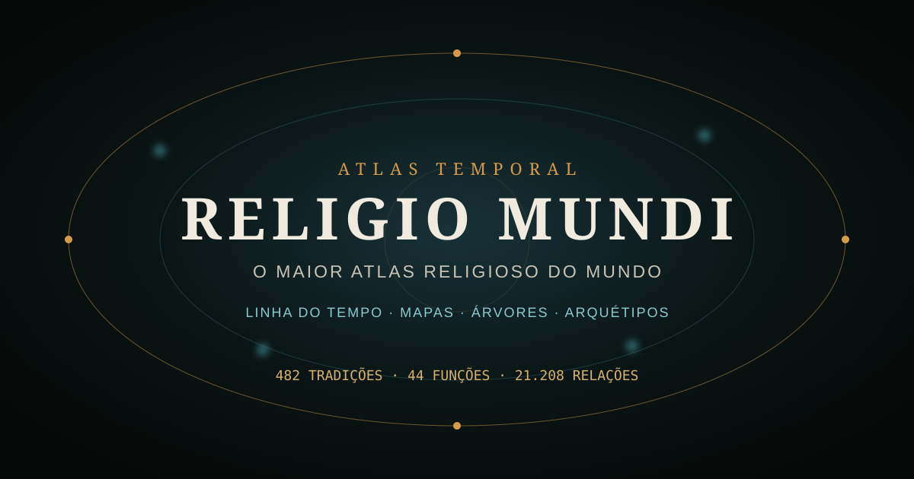
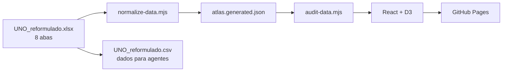

<div align="center">

<picture>
  
</picture>

# O MAIOR ATLAS RELIGIOSO DO MUNDO

### Linha do tempo, evolução histórica, mapas, árvores e arquétipos da humanidade

**471 tradições · 44 funções comparativas · 20.724 relações examináveis**

[](https://mreaggle.github.io/religiomundi/)
[](https://github.com/Mreaggle/religiomundi/actions/workflows/ci.yml)
[](https://github.com/Mreaggle/religiomundi/actions/workflows/pages.yml)


> **Os nomes mudam. As funções reaparecem. As diferenças continuam importando.**

[Abrir aplicação](https://mreaggle.github.io/religiomundi/) ·
[Metodologia](#metodologia-e-limites) ·
[Dados](#fonte-canônica-e-pipeline) ·
[Desenvolvimento](#executar-localmente)

</div>

## O que é o RELIGIO MUNDI?

RELIGIO MUNDI é um atlas histórico-comparativo que transforma uma matriz curada de religiões,
cosmovisões, registros arqueológicos e tradições espirituais em um instrumento de exploração
temporal. Não é uma lista estática nem um dashboard: é uma constelação cartográfica navegável,
sincronizada a uma escala híbrida que vai das evidências pré-históricas ao presente.

O projeto permite investigar perguntas como:

- quais tradições estão documentadas em determinado período;
- onde aparecem aproximadamente no mapa;
- quais funções comparativas recebem entidades, práticas ou princípios;
- onde existem correlações diretas, parciais, impessoais, incertas ou ausentes;
- quais continuidades e influências possuem suporte documental.

## Instrumentos de exploração

| Modo | O que revela |
| --- | --- |
| **Constelação** | 44 arquétipos fixos ligados às tradições do recorte temporal |
| **Mapa** | distribuição regional aproximada, clustering, zoom e catálogo completo |
| **Árvore** | derivações e influências curadas; bosque separado para proximidade sem genealogia |
| **Matriz** | heatmap virtualizado das 20.724 células comparativas |
| **Assinaturas** | impressões funcionais de 44 segmentos para comparação |
| **Fontes** | biblioteca navegável das referências usadas na revisão |

Também estão disponíveis busca tolerante a acentos, filtros combináveis, dossiês, Câmara de
Comparação, reprodução automática da história, lista acessível e a camada autoral **Aeons**,
desativada e epistemicamente separada por padrão.

## Metodologia e limites

Aqui, **arquétipo é uma ferramenta de indexação comparativa**. Função semelhante não significa
entidade idêntica, origem comum, influência direta ou universal psicológico. A legenda preserva o
status de cada célula:

| Símbolo | Classificação |
| :---: | --- |
| `●` | direto ou central |
| `≈` | parcial, variante ou metafórico |
| `◇` | princípio impessoal, ético ou não personificado |
| `?` | hipótese, debate ou documentação insuficiente |
| `—` | sem correlato suficientemente documentado nesta matriz |

Datas ambíguas continuam aproximadas. Coordenadas representam regiões modernas de interface, não
precisão arqueológica. O catálogo é amplo, mas não exaustivo.

## Fonte canônica e pipeline

`public/data/UNO_reformulado.xlsx` é a autoridade editorial. O pipeline preserva texto integral,
acentos, diacríticos e símbolos:



- **471** tradições, cosmovisões e registros;
- **44** arquétipos funcionais, de `A01` a `A44`;
- **20.724** células comparativas;
- **44** registros de fontes;
- texto original de período e correlação sempre preservado.

As listas da Wikimedia Commons, Wikipedia e Open Mind Project são checklists investigativos de
cobertura, nunca evidência suficiente para doutrina ou datação.

## Arquitetura

```text
src/components/     instrumentos, painéis, dossiês e visualizações
src/state/          estado global previsível do atlas
src/utils/          tempo, filtros, clustering, análise e anticolisão
public/data/        planilha canônica e JSON normalizado
data/               CSV estruturado para agentes
scripts/            normalização, reconstrução e auditoria
e2e/                fluxos Playwright em desktop e mobile
skills/             papéis especializados e Q.A. reutilizável
.github/workflows/  validação e publicação automática
```

## Executar localmente

Requer **Node.js 20.19+**. A reconstrução da planilha também usa Python e `openpyxl`.

```bash
git clone https://github.com/Mreaggle/religiomundi.git
cd religiomundi
npm install
npm run dev
```

Abra `http://localhost:5173`.

<details>
<summary><strong>Comandos disponíveis</strong></summary>

| Comando | Finalidade |
| --- | --- |
| `npm run dev` | normaliza os dados e inicia o Vite |
| `npm run data:build` | converte XLSX em JSON normalizado |
| `npm run data:audit` | audita dimensões, IDs, fontes, assinaturas e datas-sentinela |
| `npm test` | executa Vitest |
| `npm run test:e2e` | executa Playwright em desktop e celular |
| `npm run lint` | verifica código, estilos e formatação com Biome |
| `npm run build` | gera dados, verifica TypeScript e compila produção |
| `npm run check` | executa lint, testes, build e auditoria |

</details>

## Qualidade e acessibilidade

Toda alteração deve preservar:

- teclado, foco visível, leitores de tela e movimento reduzido;
- celular em retrato e paisagem, sem rolagem horizontal involuntária;
- zoom focal com crescimento progressivo de texto e alvos;
- isolamento reversível de tradição ou arquétipo;
- cores por arquétipo e padrões de traço independentes da cor;
- ausência de erros no console e de perfis integrais repetidos.

O procedimento completo está em
[`skills/qa-religiomundi/SKILL.md`](./skills/qa-religiomundi/SKILL.md).

## Contribuindo

Leia [`AGENTS.md`](./AGENTS.md), preserve `collision.png` e quaisquer arquivos locais do usuário, e
abra um PR com:

1. causa raiz e impacto;
2. fontes alteradas, quando houver;
3. testes executados;
4. captura antes/depois para mudanças visuais.

Commits devem ser curtos e imperativos, como `Fix archetype fiber coverage`.

## Publicação

Cada merge em `main`:

1. executa a suíte **Validate atlas**;
2. compila com base `/religiomundi/`;
3. publica `dist/` pelo workflow oficial do GitHub Pages.

Produção: **https://mreaggle.github.io/religiomundi/**

---

<div align="center">
  <strong>Veja os nomes. Compare as funções. Preserve as diferenças.</strong>
</div>
